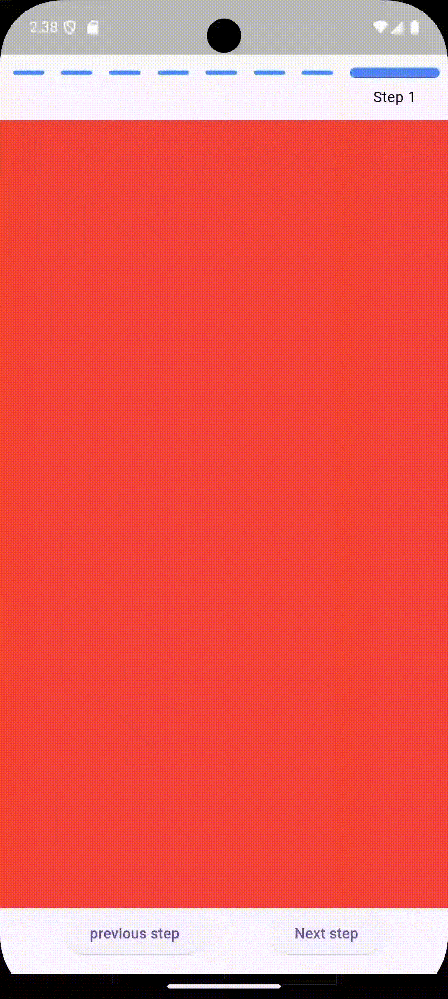

a custom stepper without used any packages and simple to use.

## Features

This is a demo of my custom widget:



## Usage


```dart
import 'package:flutter/material.dart';
import 'package:custom_stepper/custom_stepper.dart';

void main() {
  runApp(const MyApp());
}

class MyApp extends StatefulWidget {
  const MyApp({super.key});

  @override
  State<MyApp> createState() => _MyAppState();
}

class _MyAppState extends State<MyApp> {
  int currentStep = 0;

  void goToStep(int step) {
    setState(() {
      currentStep = step.clamp(0, 7);
    });
  }

  getColor(int index) {
    if (index == 0) {
      return Colors.red;
    } else if (index == 1) {
      return Colors.green;
    } else if (index == 2) {
      return Colors.blue;
    } else if (index == 3) {
      return Colors.orange;
    } else if (index == 4) {
      return Colors.white;
    } else if (index == 5) {
      return Colors.brown;
    } else if (index == 6) {
      return Colors.cyan;
    } else if (index == 7) {
      return Colors.purple;
    }
  }

  @override
  Widget build(BuildContext context) {
    return MaterialApp(
      debugShowCheckedModeBanner: false,
      home: CustomStepper(
        itemCount: 8,
        activeStep: currentStep,
        textStyle: const TextStyle(fontSize: 14.0, color: Colors.black),
        titles: const ['Step 1', 'Step 2', 'Step 3', 'Step 4', 'Step 5', 'Step 6', 'Step 7', 'Step 8'],
        duration: const Duration(milliseconds: 2000),
        color: Colors.blueAccent,
        bodyChild: Container(
          color: getColor(currentStep),
        ),
        footerChild: Row(
          mainAxisAlignment: MainAxisAlignment.spaceEvenly,
          children: [
            ElevatedButton(
              onPressed: () {
                goToStep(currentStep + 1);
              },
              child: const Text('Next step'),
            ),
            ElevatedButton(
              onPressed: () {
                goToStep(currentStep - 1);
              },
              child: const Text('previous step'),
            ),
          ],
        ),
      ),
    );
  }
}


```
